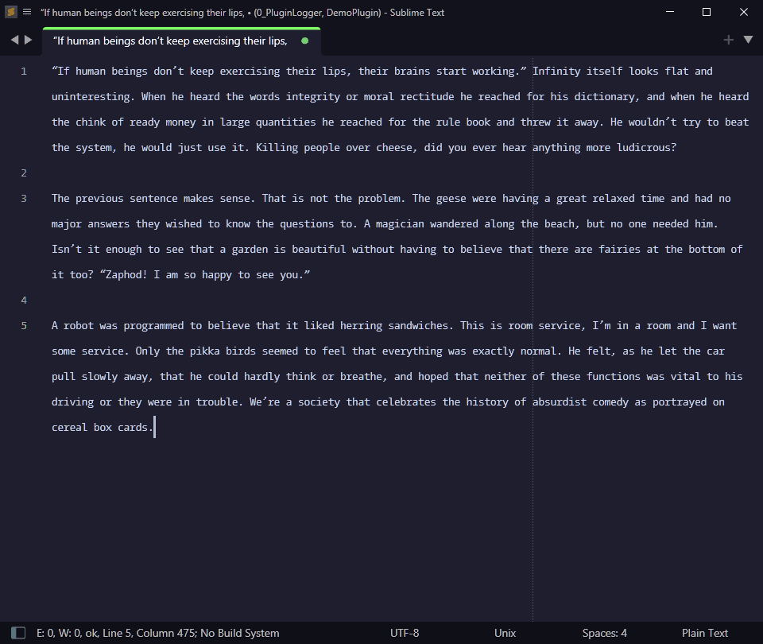

### Plugin Logger

---

📜 Displays the source plugin of your console logs

##### Installation

- Install from `packagecontrol.io` or unpack the [zip](https://github.com/kapitanluffy/sublime-plugin-logger/archive/master.zip) in your packages directory

##### Support

You can always support me via [Patreon](https://www.patreon.com/kapitanluffy) or [Ko-fi](https://www.ko-fi.com/kapitanluffy)

##### License

[MIT](LICENSE)
